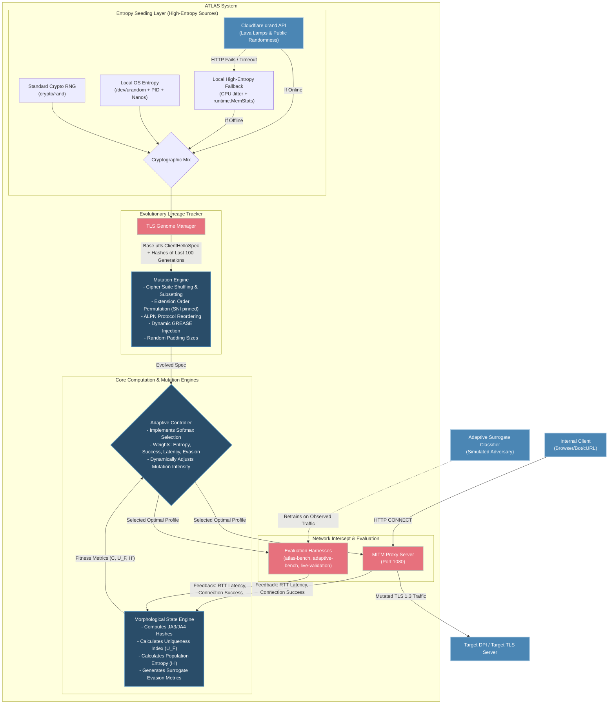

# ATLAS System Architecture Diagram

This diagram illustrates the structural architecture of the ATLAS system, breaking down the highly-coupled modular components that power the evolutionary TLS camouflage mechanism.

